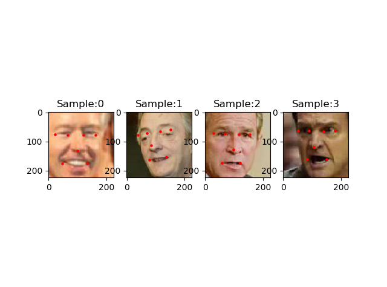
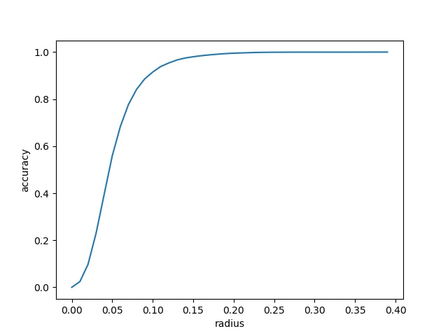

# Facial Landmark Regression

This project aims to detect facial landmarks from RGB images. It is trained on images from [LFW Face Database](http://vis-www.cs.umass.edu/lfw/), with [landmark annotation](http://cmp.felk.cvut.cz/~uricamic/flandmark/). It uses PyTorch as framework.

## Training details

* Implements data augmentations like random crop and random flip.

* Uses pretrained AlexNet and modified the fully-connected layers for facial regression.

## Results

* Sample ground truth and results



* Accuracy









