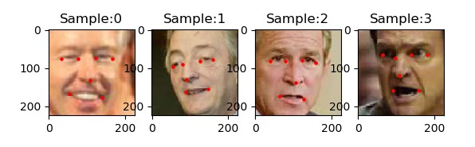
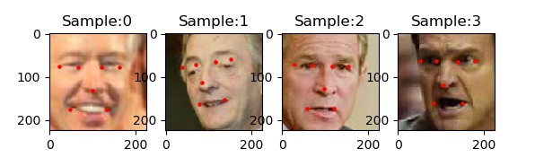

# Facial Landmark Regression

This project aims to detect facial landmarks from face photographs.

## Prerequisites
* Python: 3.5, 3.6
* torch: 0.4.1
* torchvision: 0.2.1
* numpy

## Dataset
* images: [LFW Face Database](http://vis-www.cs.umass.edu/lfw/)
* annotation: [landmark annotation](http://cmp.felk.cvut.cz/~uricamic/flandmark/)

## Results

* Sample ground truth and results   
  


* Accuracy   














